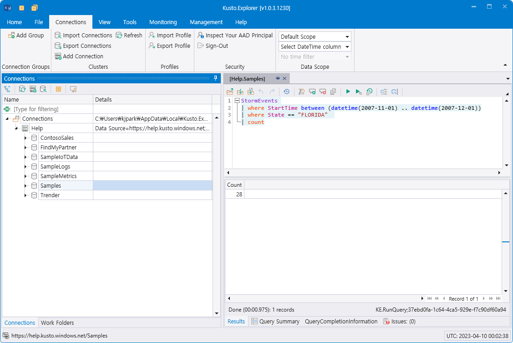

# Kusto Query Language (KQL) overview

Kusto Query Language는 data를 탐색하고, patterns 발견, 이상 현상이나 특이점을 확인하는 등의 통계 모델링을 생성하는 강력한 도구입니다. Query는 SQL에서 database 또는 tables, columns 등과 같이 계층적으로 조직화된 schema 항목을 사용합니다.

Query는 하나 이상의 query statements로 구성되며 semicolon (`;`)으로 구분합니다.  Query는 아래의 3가지 종류가 있습니다:

- A [tabular expression statement](https://learn.microsoft.com/en-us/azure/data-explorer/kusto/query/tabularexpressionstatements)
- A [let statement](https://learn.microsoft.com/en-us/azure/data-explorer/kusto/query/letstatement)
- A [set statement](https://learn.microsoft.com/en-us/azure/data-explorer/kusto/query/setstatement)

Query는 tabular expression statement를 꼭 포함하여야 하며 tabular expression statement는 하나 이상의 tabular results를 생성합니다.

가장 일반적인 query statement가 tabular expression statement이며 zero 또는 이상의 operators로 구성되며, Operators는 `|` (pipe)로 순차적으로 구분되어 다음 operator로 data flows 또는 pipe되어지며 깔데기와 같이 data를 filter하거나 manipulate 합니다.

```kusto
StormEvents 
| where StartTime between (datetime(2007-11-01) .. datetime(2007-12-01))
| where State == "FLORIDA"  
| count
```

> [!INFO]  
> Kusto.Explorer 도구 등을 이용하여 Azure Data Explorer의 sample database에 대하여 query를 할 수 있습니다.  
> Kusto.Explorer 설치 및 이용에 대하여는 [Kusto.Explorer](https://learn.microsoft.com/en-us/azure/data-explorer/kusto/tools/kusto-explorer) 를 참조하세요.
>
> 또는, [Azure Data Explorer](https://dataexplorer.azure.com/clusters/help/databases/Samples)에서 직접 query를 할 수 있습니다.

Kusto.Explorer에서 Azure Data Explorer의 sample database에 query하는 화면입니다:



> [!NOTE]  
> KQL은 table 또는 column, operator, function 등에 대하여 case-sensitive 합니다.

**Kusto queries에 대하여 좀 더 확인하려면 [Tutorial: Write Kusto queries](https://learn.microsoft.com/en-us/azure/data-explorer/kusto/query/tutorial) 를 확인하세요.**

## Control commands

Kusto queries와 달리, [Control commands](https://learn.microsoft.com/en-us/azure/data-explorer/kusto/management/)는 data 또는 metadata를 수정 또는 처리를 요청합니다. 아래의 예제 control command는 `Level`과 `Text` 두 개의 columns이 있는 `Logs` table을 생성합니다.

```kusto
.create table Logs (Level:string, Text:string)
```

모든 control commands가 data 및 metadata를 수정하지는 않습니다. 예를 들어 `.show tables` command는 현재 database의 모든 tables을 목록을 return합니다.


---

