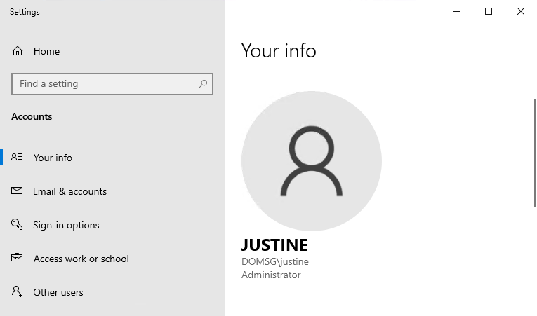
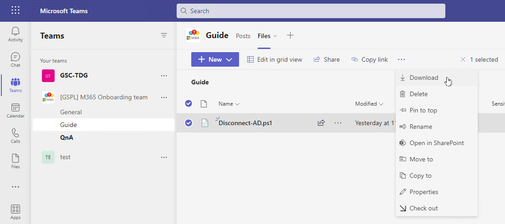
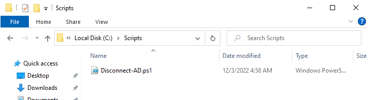
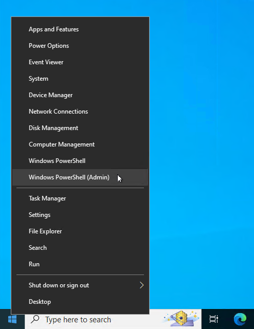
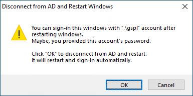

# Join to AzureAD

## Verify your account information

check whether you are currently using an AD account or a local account.

1. Press <kbd>windows</kbd> + <kbd>R</kbd> and type "**ms-settings:yourinfo**" in text box and select `OK`.

1. check Your info as the below picture:

    

    If you are using AD account, you can check the domain name as like "**`DOMSG\<your-id>`**". "**DOMSG**" is your domain name.

    if you are using a local account go to the **[Join to Azure AD](#join-to-azure-ad)** step.

## Disconnect from AD

1. You need to disconnect from AD in the followed steps.

    download the provision script file from Teams or the followed link:

    [Disconnect-AD.ps1](src/Disconnect-AD.ps1)

    You can download the provision script file from **Guide** channel in **[GSPL] M365 Onboarding team** team as like follow picture:

    

    You should save this provision script file to **`C:\Scripts`** folder. if the folder is not exist, you should create the folder at first.

    

1. Run the Windows PowerShell as administrator.

    Press <kbd>windows</kbd> + <kbd>X</kbd> and select "**Windows PowerShll (Admin)**"

    

1. Run the follow command in Windows PowerShell.

    ```powershell
    Set-ExecutionPolicy -ExecutionPolicy RemoteSigned -Force
    ```

    > [!NOTE]  
    > In Windows 11, You should use `ByPass` instead of `RemoteSigned`

1. Run the provision script in Windows PowerShell

    ```powershell
    C:\Scripts\Disconnect-AD.ps1
    ```

1. In the popuped window, **Disconnect from AD and Restart Windows**, check the account name that can sign-in after restarting windows and Select **`OK`**.

    

    It will be restart your windows and sign-in via local user automatically.

## Join to Azure AD

1. Press <kbd>windows</kbd> + <kbd>R</kbd> and type "**`ms-settings:workplace`**" in text box and select `OK`.

Now, You can join your windows to Azure AD. please refer the provided guide.

---
