
# Exchange Mail Flow and Recipient Types

---

Contents:

- [Exchange Mail Flow Design and Configuration](#exchange-mail-flow-design-and-configuration)
- [Exchange Recipient Types and Explanation](#exchange-recipient-types-and-explanation)
- [Exchange Clients Services](#exchange-clients-services)

---

## Exchange Mail Flow Design and Configuration

### SMTP & DNS protocol in Mail Flow Conceptual Aspect

#### Simple Mail Transfer Protocol (RFC5321)

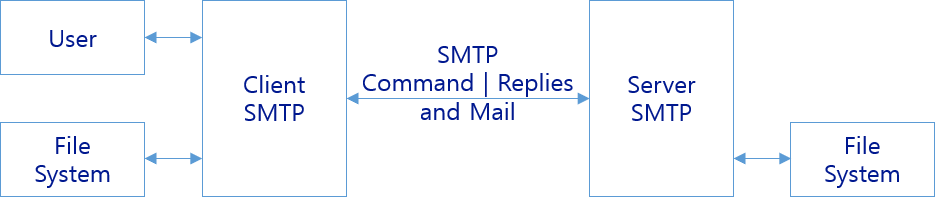

> [!INFO]  
> SMTP Service Extension for Secure SMTP over Transport Layer Security (RFC3207) ~ STARTTLS command for secure SMTP

```dos
EHLO movetocloud.online
MAIL FROM: mimi@movetocloud.online
RCPT TO: kjpark@tdgl.co.kr
DATA
Subject: Test mail flow to tdgl.co.kr

This is a test message...
.
```

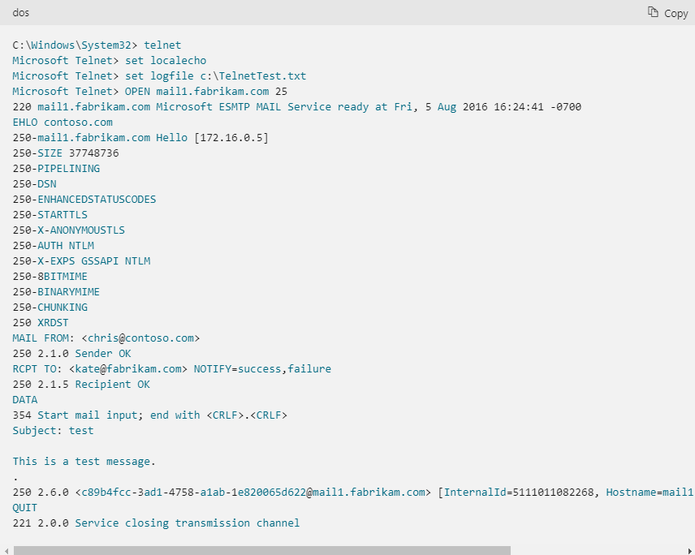

> [!INFO]  
> [Use Telnet to test SMTP communication on Exchange servers](https://docs.microsoft.com/en-us/exchange/mail-flow/test-smtp-with-telnet)

#### Domain Names

- Concepts and Facilities (RFC1034)
- Implementation and Specification (RFC1035)

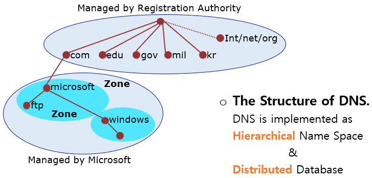

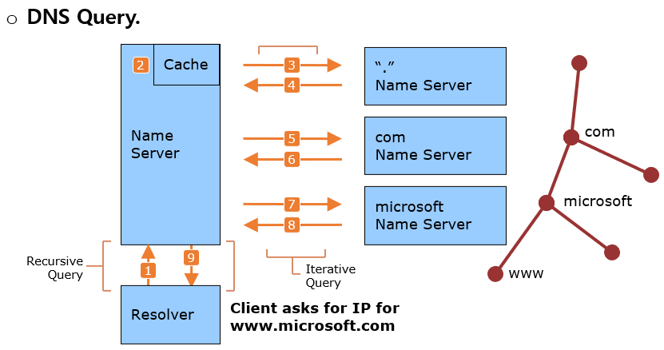

#### Exchange Mail Flow & Client Access for DNS Resource Records

##### MX Record

Recipient Domain의 Mail Exchanger의 정보를 나타냄.

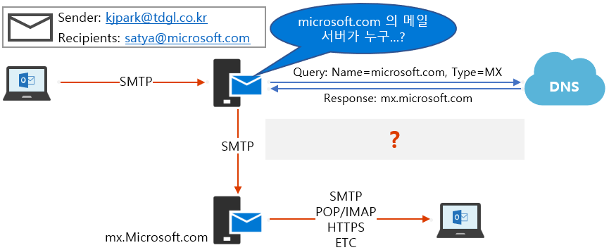

##### Sender Policy Framework (SPF: RFC4408)

Mail의 Sender(Mail Exchanger)를 확인하는 과정을 통해 phishing 이나 spam을 줄이기 위하여 사용되어지는 기술.

Sender domain 공인된 DNS의 다음 record들 Query하여 Sender ID를 확인:

- MX 및 A(CNAME) Record
- TXT 중 SPF 정보 (예: v=spf1 include:spf.protection.outlook.com –all)

> [!INFO]  
> [SPF Record Syntax (open-spf.org)](http://www.open-spf.org/SPF_Record_Syntax/)

##### DKIM (RFC5585) & DMARC (RFC7489)

- DomainKeys Identified Mail (DKIM)

    [How to use DKIM for email in your custom domain - Office 365 &#124; Microsoft Docs](https://docs.microsoft.com/en-us/microsoft-365/security/office-365-security/use-dkim-to-validate-outbound-email)

- Domain-based Message Authentication, Reporting & Conformance (DMARC)

    [Use DMARC to validate email, setup steps - Office 365 &#124; Microsoft Docs](https://docs.microsoft.com/en-us/microsoft-365/security/office-365-security/use-dmarc-to-validate-email)

##### AUTODISCOVER.TDGL.CO.KR (A &#124; CNAME &#124; SRV Record)

- Microsoft Exchange Server의 Autodiscover 서비스에서 사용하는 DNS Record
- AUTODISCOVER  A 또는 CNAME, SRV  DNS record로 구성할 수 있음

### Inbound & Outbound Mail Flow

#### Inbound Mail Flow

##### Inbound Mail Flow without Edge

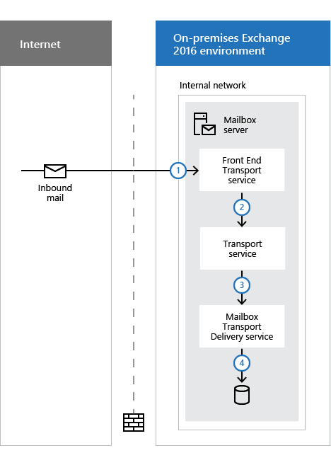

##### Inbound Mail Flow with Edge

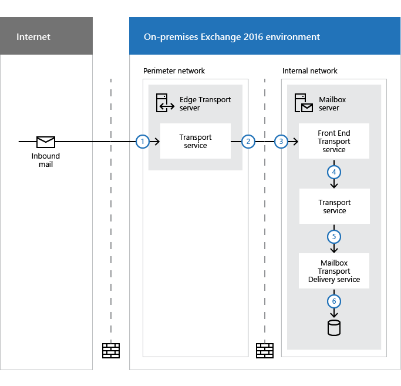

#### Outbound Mail Flow

##### Outbound Mail Flow without Edge

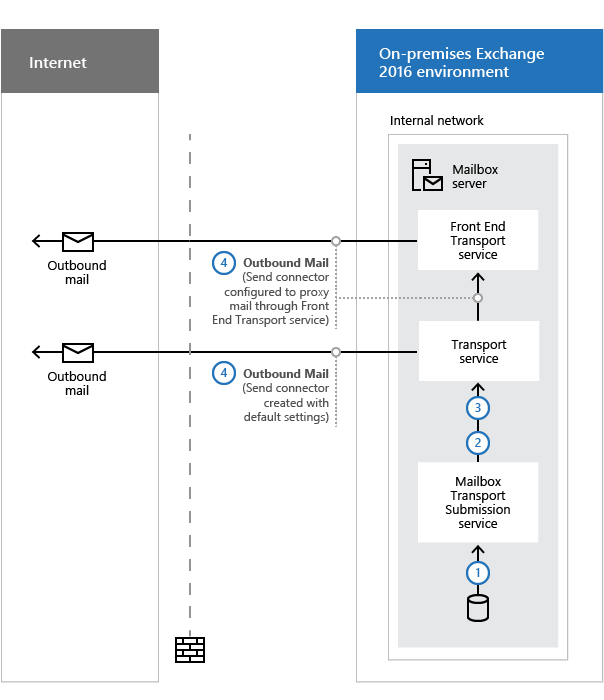

##### Outbound Mail Flow with Edge

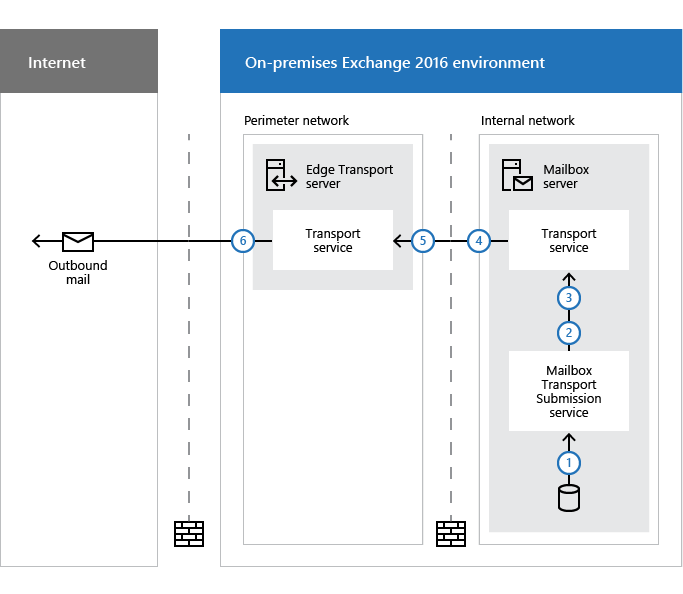

##### [Non-delivery Reports](https://docs.microsoft.com/en-us/exchange/mail-flow/non-delivery-reports-and-bounce-messages/non-delivery-reports-and-bounce-messages)

#### Connectors & Accepted Domains

##### Exchange Connectors

- **Receive Connectors.** 수신 커넥터는 들어오는 SMTP 메일 흐름을 제어합니다. 커넥터의 구성과 일치하는 들어오는 연결을 수신합니다.

    [Receive connectors &#124; Microsoft Docs](https://docs.microsoft.com/en-us/exchange/mail-flow/connectors/receive-connectors)

    Customer Receive Connectors:

    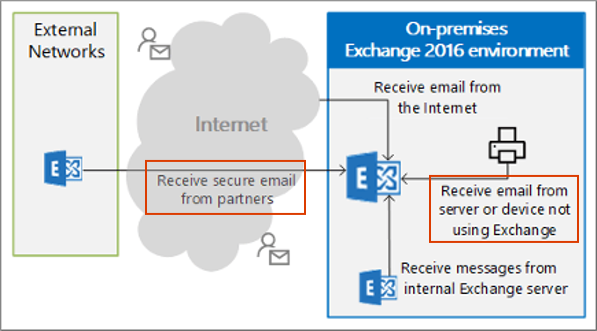

- **Send Connectors.** 송신 커넥터는 보내는 SMTP 메일 흐름을 제어합니다. 메시지 받는 사람 및 커넥터의 구성에 따라 송신 커넥터가 선택됩니다.

    [Send connectors in Exchange Server &#124; Microsoft Docs](https://docs.microsoft.com/en-us/exchange/mail-flow/connectors/send-connectors)

    - Internet Mail Send Connectors
    - Outbound Smart Host Routing

- **[Protocol Logging &#124; Microsoft Docs](https://docs.microsoft.com/en-us/exchange/mail-flow/connectors/protocol-logging)**

##### Accepted Domain

Accepted Domains은 Exchange Organization의 메일을 수신하게 구성된 SMTP address namespace.  Email Address Policies에서 사용.

- Authoritative Domains
- Relay Domains (Internal Relay & External Relay)

### Transport Availability and Features

#### Transport Agents

Transport Agent는 Microsoft 또는 3rd-Party vendor에 제공하는 소프트웨어를 설치할 수 있으며, transport pipeline을 통해 들어온 email messages들에 대한 추가적인 process 또는 action 처리를 할 수 있게 합니다.

##### Transport Agent 분류

- SmtpReceiveAgent
- RoutingAgent
- DeliveryAgent

> [!INFO]  
> [Built-in Transport Agent &#124; Microsoft Docs](https://docs.microsoft.com/en-us/exchange/mail-flow/transport-agents/transport-agents?#built-in-transport-agents)

##### [Mail Flow & Transport Pipeline &#124; Microsoft Docs](https://docs.microsoft.com/en-us/exchange/mail-flow/mail-flow)


#### Transport High Availability & Queues

##### Transport High Availability

Exchange 서버는 message가 성공적으로 배달되기 전/후로 redundant copies를 유지하여 Transport에 대한 High Availability를 확보합니다.

Exchange 서버의 Transport High Availability을 제공하는 핵심 기능은 아래와 같습니다:

- [Shadow Redundancy](https://docs.microsoft.com/en-us/exchange/mail-flow/transport-high-availability/shadow-redundancy)
    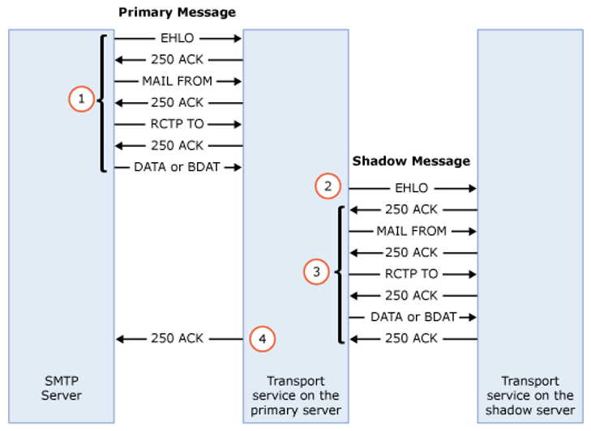

- [Safety Net](https://docs.microsoft.com/en-us/exchange/mail-flow/transport-high-availability/safety-net)

**Transport High Availablity with Shadow Redundancy and Safety Net**

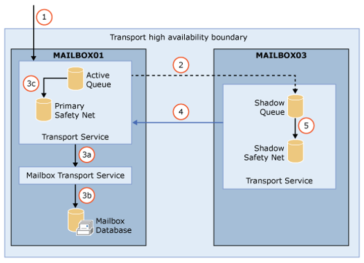

##### [Queues and messages in queues in Exchange Server &#124; Microsoft Docs](https://docs.microsoft.com/en-us/exchange/mail-flow/queues/queues)

#### [Message Size and Recipient Limits](https://docs.microsoft.com/en-us/exchange/mail-flow/message-size-limits)

**Scope of Limits**

1. Organizational Limits
1. Connector Limits
1. Server Limits
1. Recipient Limits

**Types of message size limits**

- Whole message size limits
- Attachment size limits
- Recipient limits
- Message header size limits

---

## Exchange Recipient Types and Explanation

### Exchange Recipient Types

#### Mailbox

- **User Mailbox**

    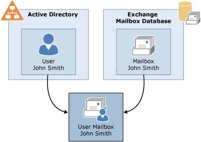

    > [!IMPORTANT]  
    > Mailbox를 생성하면 Exchange에서 사용하는 mailbox에서 필요로 하는 attributes들이 Active Directory의 사용자 개체에 추가됩니다.

- **Linked Mailbox**

    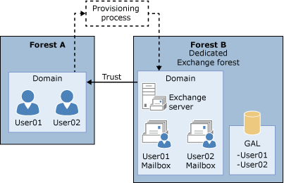

- **Microsoft 365 Mailbox.** Exchange Online에 생성되는 사서함. 사용자는 AADC 환경에서 동기화된 사용자이거나 pure cloud 사용자일 수 있습니다.

- **Shared Mailbox.** 한 명의 사용자에게 할당되지 않고 여러 사용자들이 액세스할 수 있게 설정된 사서함.

    일반적인 Mailbox Permission:

    - Full Access
    - Send As
    - Send on Behalf

- Resource Mailbox

    - Room Mailbox (Exchange Online: `Set-Place` cmdlet)
    - Equipment Mailbox

- System Mailboxes

    | Mailbox | Name |
    |---|---|
    | Organization | SystemMailbox {bb558c35-97f1-4cb9-8ff7-d53741dc928c} |
    | Message approval | SystemMailbox {1f05a927-xxxx-xxxx-xxxx-xxxxxxxxxxxx_}<br>where xxxx-xxxx-xxxx-xxxxxxxxxxxx is a randomly assigned and unique GUID for each Exchange forest |
    | UM data storage | SystemMailbox {e0dc1c29-89c3-4034-b678-e6c29d823ed9}<br>This mailbox exists in Exchange 2016, not in Exchange 2019 |
    | Discovery | DiscoverySearchMailbox {D919BA05-46A6-415f-80AD-7E09334BB852} |
    | Federated email | FederatedEmail.4c1f4d8b-8179-4148-93bf-00a95fa1e042 |
    | Migration | Migration.8f3e7716-2011-43e4-96b1-aba62d229136 |


#### Distribution Groups

Exchange에서 사용하는 대표적인 group objects들은 아래와 같습니다:

- **Distribution groups.** Active Directory universal distribution group objects that are mail-enabled.

- **Mail-enabled security groups.** Active Directory universal security group objects that are mail-enabled. They can be used to assign access permissions to resources

- **Dynamic distribution groups.** Distribution groups whose membership is based on specific recipient filters

    사용 가능한 Filters들은 아래와 같습니다:

    - Custom attributes 1-15
    - State or province
    - Company
    - Department
    - Recipient container

    > [!INFO]  
    > [Manage dynamic distribution groups &#124; Microsoft Docs](https://docs.microsoft.com/en-us/exchange/recipients/dynamic-distribution-groups/dynamic-distribution-groups)
#### Mail Users & Mail Contacts

Exchange Organization의 외부에 존재하는 사용들에 대한 정보를 포함.

- **Mail contacts.** These are mail-enabled Active Directory contacts that exist outside your Exchange organization.

- **Mail forest contacts.** These represent recipient objects from another forest. These contacts are typically created by directory synchronization.

- **Mail users.** Mail users are similar to mail contacts. mail users have Active Directory logon credentials and can access resources

### Recipient Features

- Email Addresses and Forwarding
- Message delivery restrictions
- Mailbox message size limits
- Storage quotas
- Deleted Item retention and Recoverable Items
- Mail Tip
- Moderation
- Antispam and Antimalware

#### Messaging policy and compliance

https://docs.microsoft.com/en-us/exchange/policy-and-compliance/policy-and-compliance

| Feature | Description |
|---|---|
| In-Place Archiving | In-Place Archiving helps you regain control of your organization's messaging data by eliminating the need for personal store (.pst) files and allowing users to store messages in an archive mailbox accessible in Outlook 2010 and later and Outlook on the web. |
| In-Place Hold and Litigation Hold | When a reasonable expectation of litigation exists, organizations are required to preserve electronically stored information, including email that's relevant to the case. In-Place Hold allows you to search and preserve messages matching query parameters. Litigation Hold only allows you to place all items in a mailbox on hold. For both types of holds, messages are protected from permanent deletion, modification, and tampering and can be preserved indefinitely or for a specified period. |
| In-Place eDiscovery | In-Place eDiscovery allows you to search mailbox data across your Exchange organization, preview search results, copy search results to a Discovery mailbox, or export the results to a PST file |
| Administrator audit logging | Administrator audit logs enable you to keep a log of changes made by administrators to Exchange server and organization configuration and to Exchange recipients. You might use administrator audit logging as part of your change control process or to track changes and access to configuration and recipients for compliance purposes. |
| Mailbox audit logging | Because mailboxes can potentially contain sensitive, high business impact information and personally identifiable information, it's important that you track who logs on to the mailboxes in your organization and what actions are taken. It's especially important to track access to mailboxes by users other than the mailbox owner (known as delegate users). Using mailbox audit logging, you can log mailbox access by administrators, delegates (including administrators with full access permissions), and mailbox owners. |
| Data loss prevention | Data loss prevention (DLP) in Exchange Server includes 80 sensitive information types that are ready for you to use in your DLP policies. |
| Mail flow rules (also known as transport rules) | Use mail flow rules to look for specific conditions in messages that pass through your organization and take action on them. You can use conditions and exceptions to define when a mail flow rule is applied, and then apply an action on messages when the conditions are met. |

#### Mailbox Permissions & Search, Move

---

## Exchange Clients Services

### Clients Type & Services

#### Autodiscover Service

#### MAPI over HTTP & POP3, IMAP

#### Mobile Outlook App & ActiveSync

#### Outlook on the Web

### Mailbox Access & Policies

#### Mailbox Access

#### Mobile Device Mailbox Policy

#### OWA Mailbox Policy

---