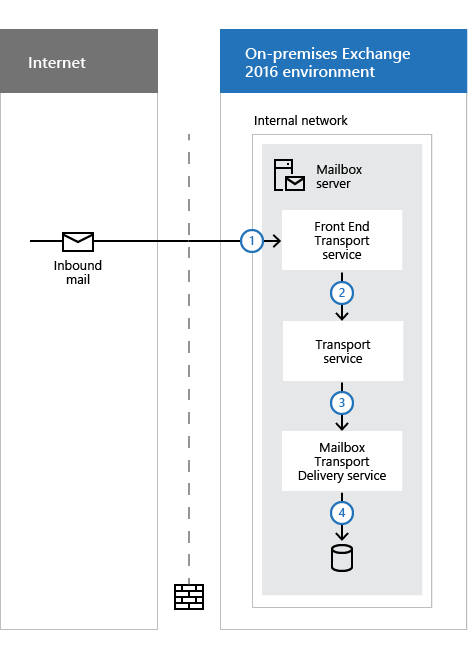
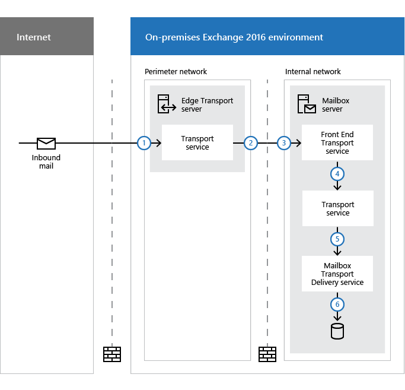
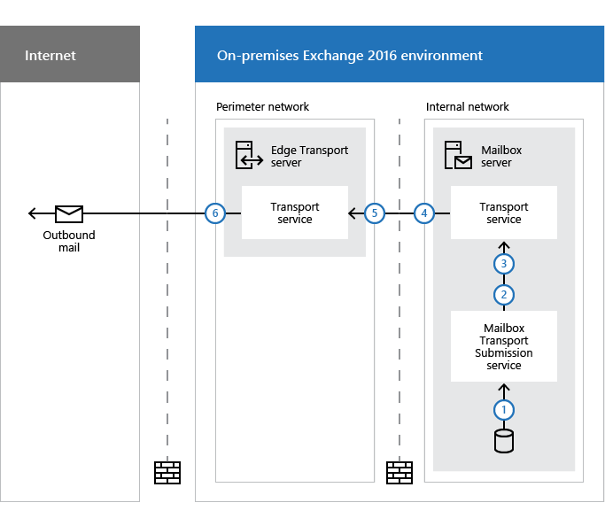

# Understanding the Transport Pipeline

Transport Pipeline은 아래의 서비스로 구성되어 있습니다.

- Front End Transport service on Mailbox servers

- Transport service on Mailbox servers

- Mailbox Transport service on Mailbox servers

    - Mailbox Transport Submission service

    - Mailbox Transport Submission service

- Transport service on Edge Transport servers

아래의 diagram은 Exchange Transport Pipeline의 구성요소간의 관계를 설명합니다.

## Exchange Mail flow without Edge Transport Server

## Exchange Mail flow with Edge Transport Server

## Understanding the Transport service on Mailbox servers

## Understanding the Transport service on Edge Transport servers

