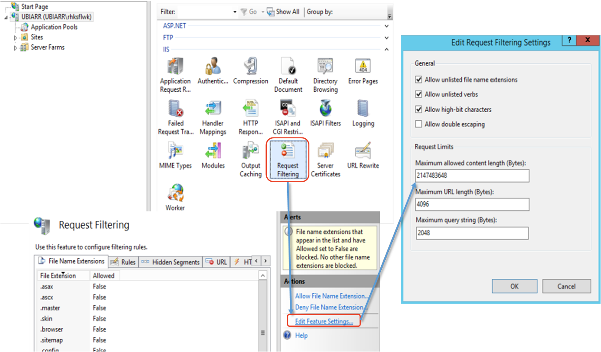

# Deploy ARR as Reverse Proxy for Exchange

오래전에 ForeFront TMG (이전의 ISA)는 Exchange Server를 포함하는 많은 applications을 위한 Microsoft의 Reverse Proxy 솔루션을 사용되었으나 더 이상의 제품에 대한 road map이 없어 유지 관리가 어렵습니다.

3rd party Reverse Proxy를 사용할 수도 있으나 Windows Server 기반의 IIS에 Application Request Routing (ARR)과 URL Rewrite 모듈을 통해 복잡하고 유연한 load balancing 및 reverse proxy 구현이 가능합니다.

아래의 그림은 ARR을 어떻게 구현할 수 있는지를 보여주는 아키텍처입니다:


>[!INFO]  
> Exchange 서버로의 Clients 액세스 또는 Exchange Hybrid 환경에서 Exchange Online에서 Exchange 서버의 EWS 액세스를 ARR을 통해 가능하게 해줄 수 있습니다.

## Prerequisites

- **Domain or Workgroup**: IIS ARR 서버는 domain join이 필요하지 않습니다.
- **Network Interface Cards**: IIS ARR 서버는 Internal 네트워크와 External 네트워크를 위한 두 개의 NICs를 필요로 합니다.
- **DNS name resolution**: 내부 DNS 서버를 이용하지 않는 경우 HOSTS 파일을 이용하도록 IIS ARR 서버를 설정할 수 있습니다.
- **Exchange Service URLs**: Exchange의 OWA 및 EWS, EAS, Outlook Anywhere의 Internal 과 External URLs을 확인이 필요합니다.
- **Certificate**: Exchange Service의 URLs에 대하여 올바른 Server Certificate가 설치되어야 합니다.

## Installing ARR

ARR은 Windows Server 2008 이상의 IIS를 필요로 합니다. Windows Server 2016이나 _Windows Server 2019_에서 정상적으로 배포 및 동작하는 것을 확인하였습니다.

1. .NET 및 Tracing을 포함한 IIS를 설치합니다.

    ```powershell
    # in Windows Server 2016
    
    Add-WindowsFeature  Web-Static-Content `
                        Web-Default-Doc `
                        Web-Dir-Browsing `
                        Web-Http-Errors `
                        Web-Http-Logging `
                        Web-Request-Monitor `
                        Web-Http-Tracing `
                        Web-Filtering `
                        Web-Stat-Compression `
                        Web-Mgmt-Console `                
                        NET-Framework-45-Core `
                        NET-WCF-HTTP-Activation45
    
    ```

1. Microsoft Application Request Routing 모듈과 IIS URL Rewrite 모듈 다운로드 및 설치
		
    1. IIS URL Rewrite Module 2
    1. Web Farm Framework
    1. Microsoft Application Request Routing 3.0
    1. Microsoft External Cache

1. Server Certificate 설치

    Server Certificate에는 올바른 Subject Name 또는 SAN에 호스팅하는 Exchange Web Services의 URL을 포함하고 있어야 합니다.

1. Server Farm 생성

1. Server Farm 구성 변경

    1. Disable Disk Cache
    1. Health Test: 올바른 URL(autodiscover 및 EWS, OAB 등)과 Interval(5 seconds), Time-Out(30 seconds), Acceptable Status Code(200) 설정
    1. Load Balance: Least Current Request
    1. Proxy: Time-Out(200 seconds)과 Response Buffer threshold(0) 설정
    1. Routing Rules: Enable SSL Offloading 해제

    

1. URL Rewrite Rules 생성

    

1. Request Filtering 설정

    

> [!TODO] ...

...

> [!REF] [Reverse Proxy for Exchange Server 2013 using IIS ARR](https://techcommunity.microsoft.com/t5/exchange-team-blog/part-1-reverse-proxy-for-exchange-server-2013-using-iis-arr/ba-p/592526)

> [!REF]
>
> - ARR (Application Request Routing) 모듈을 Windows Server 기반에 IIS에서 동작하는 extension입니다
> - Microsoft Web Platform Installer를 통해 필요한 모듈들을 선택으로 자동을 다운로드 받아 설치할 수 있습니다.
> - Microsoft Web Platform Installer를 통해서 배포하지 않고 필요한 모듈을 개별적으로 다운로드 받아 설치할 수도 있습니다.
> - Windows Server 2016에서 설치 및 구성을 해 보았으나 Windows Server 2019에서는 확인하지 못했기에 확인이 필요할 수 있습니다.
> - ARR 모듈이 조금 오래된 모듈이고 새로운 버전이 나오지 않은지 상당한 기간이 지나서 이를 고려하여야 합니다.

---