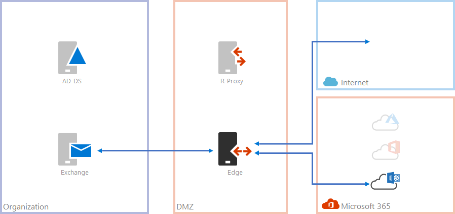

# Deploy Exchange Edge

<i class="fa fa-list-ul" aria-hidden="true"></i> **In this article**

- [What is the Edge Transport Server](#what-is-the-edge-transport-server)
- [Install Exchange Edge](#install-exchange-edge)

---

## What is the Edge Transport Server

Edge Transport Server는 Exchange 조직에 mail relay 및 smart host service를 제공하여 모든 inbound 및 outbound internet mail flow를 처리합니다.

Edge Transport Server에서 실행되는 Agents는 추가적인 메시지 보호 및 보안 계층을 제공합니다. 이러한 Agents는 스팸으로부터 보호하고 메일 흐름을 제어하기 위해 메일 흐름 규칙(전송 규칙이라고도 함)을 적용합니다. 이러한 모든 기능이 함께 작동하여 내부 Exchange가 인터넷의 위협에 노출되는 것을 최소화할 수 있습니다.

### Internet mail flow

Edge Transport Server는 인터넷에서 Exchange 조직으로 들어오는 메시지를 수락합니다. Edge Transport Server에서 메시지를 처리한 후 메일은 내부 Exchange 사서함 서버로 라우팅됩니다. 먼저 Front End Transport service로 전송한 다음 Transport service로 전송합니다.

조직 내부에서 인터넷으로 보낸 모든 메시지는 Exchange Mailbox Server의 Transport service에서 메시지를 처리한 후 Edge 전송 서버로 라우팅됩니다.

DNS를 사용하여 외부 SMTP 도메인에 대한 MX 리소스 레코드를 확인하도록 Edge 전송 서버를 구성하거나 DNS 확인을 위해 메시지를 스마트 호스트로 전달하도록 Edge 전송 서버를 구성할 수 있습니다.




### Anti-spam protection

Exchange Server에서 스팸 방지 기능은 네트워크 경계에서 원치 않는 상업성 전자 메일(스팸)을 차단하는 서비스를 제공합니다.

스패머는 다양한 기술을 사용하여 조직에 스팸을 보냅니다. Edge 전송 서버는 서로 다른 스팸 필터링 및 보호 계층을 제공하기 위해 함께 작동하는 에이전트 모음을 제공하여 사용자가 스팸을 수신하지 못하도록 합니다.

### Mail flow rules on Edge Transport servers

Edge Transport Server의 mail flow rules은 인터넷에서 주고받는 메시지 흐름을 제어하는 데 사용됩니다. 지정된 조건을 충족하는 메시지에 작업을 적용하여 회사 네트워크 리소스 및 데이터를 보호하도록 각 Edge Transport Server에서 메일 흐름 규칙이 구성됩니다.

메일 흐름 규칙 조건은 메시지 제목, 본문, 헤더 또는 보낸 사람 주소의 특정 단어 또는 텍스트 패턴과 같은 데이터를 기반으로 합니다. 스팸 신뢰 수준(SCL) 또는 부착 유형. 작업은 지정된 조건이 참일 때 메시지가 처리되는 방식을 결정합니다.

가능한 작업에는 메시지 격리, 메시지 삭제 또는 거부, 추가 수신자 추가 또는 이벤트 기록이 포함됩니다. 선택적 예외는 특정 메시지가 조치가 적용되지 않도록 제외합니다.

### Address rewriting

Address rewriting은 외부 수신자에게 일관된 이메일 주소 모양을 제공합니다. 인바운드 및 아웃바운드 메시지에서 SMTP 주소를 수정하려면 Edge 전송 서버에서 주소 다시 쓰기를 구성합니다. Address rewriting은 일관된 전자 메일 주소 모양을 표시하려는 새로 병합된 조직에 특히 유용합니다.

[<i class="fa fa-chevron-up" aria-hidden="true"></i> Top](#)

---

## Install Exchange Edge

### Prerequisites

- Edge Transport servers는 Perimeter network(DMZ)에 조직의 내부 Active Directory forest의 외부에 설치하기를 권장합니다. (Domain-joined 컴퓨터에 설치 가능.)

    Edge Transport servers는 Active Directory에 직접적인 연결이 없고, Active Directory Lightweight Directory Services (AD LDS)에 recipients 정보를 저장하고 구성하고 있습니다. Mailbox 서버에서 Edge 서버로의 AD LDS 연결을 통해 recipients 정보가 동기화합니다.

- Exchange Edge Requirements on Windows Server 2019 & Windows Server 2022

    - Hardware Requirements for Edge Transport Role
        - Processor:
            - 64-bit processors, except IA64.
            - Recommended: Up to 2 sockets on physical machines
        - Memory: 64 GB minimum recommended

    - Operating Systems: Windows Server 2022(CU12 이상) 또는 Windows Server 2019

        > [!NOTE]
        >
        > - Windows Server Core에 설치를 지원하며 권장합니다. 더 이상 Desktop Experience를 필요하지 않습니다.
        > - Nano Server에 설치는 지원하지 않습니다.


    - Software
        1. [.NET Framework 4.8](https://download.visualstudio.microsoft.com/download/pr/014120d7-d689-4305-befd-3cb711108212/0fd66638cde16859462a6243a4629a50/ndp48-x86-x64-allos-enu.exe) (from CU4)
        1. [Visual C++ Redistributable Package for Visual Studio 2012](https://www.microsoft.com/download/details.aspx?id=30679)
        1. Windows Feature: Active Directory Lightweight Directory Services
        
            ```powershell
            Install-WindowsFeature ADLDS
            ```
            > [!NOTE] Exchange Setup으로 설치 시 자동으로 AD LDS를 설치합니다.

- 대상 컴퓨터의 local administrators 그룹의 구성원인 local account를 확인

### [Install the Exchange Edge Transport server role](https://learn.microsoft.com/en-us/exchange/plan-and-deploy/deploy-new-installations/install-edge-transport-role?view=exchserver-2019#install-the-exchange-edge-transport-server-role)

1. **Check for Updates?**

    - [ ] Connect to the Internet and check for update
    - [X] Don't check for updates right now

1. **Copying Files**: 일반적인 위치는 `WinDir%\Temp\ExchangeSetup` 이며 Exchange Setup log는 `C:\ExchangeSetupLogs\ExchangeSetup.log` 입니다.

1. **Introduction**

1. **License Agreement**

    - [X] I accept the terms in the license agreement.
    - [ ] I do not accept the terms in the license agreement.

1. **Recommended Settings**

    - [X] Use recommended settings.
    - [ ] Don't use recommended settings.

1. **Server Role Selection**: Edge Transport role 선택. Management Tools은 자동으로 선택

    - [X] Automatically install Windows Server roles and features that are required to install Exchange

1. **Installation Space and Location**: 기본 위치는 `C:\Program Files\Microsoft\Exchange Server\V15`

1. **Readiness Checks**: organization 및 서버 역할 필수 구성 요소 검사가 성공적으로 완료되었는지 확인합니다.

1. **Setup Progress**: Readiness Checks를 완료하고 install을 선택하면 설치과정이 진행됩니다.

1. **Setup Completed**

### [Verify an Exchange installation](https://learn.microsoft.com/en-us/exchange/plan-and-deploy/post-installation-tasks/verify-installation?view=exchserver-2019)

- `Get-ExchangeServer` 실행

    ```powershell
    Get-ExchangeServer
    ```

- Windows Application log 및 Exchange Setup Log 확인

    일반적인 Exchange Setup log는 `C:\ExchangeSetupLogs\ExchangeSetup.log` 입니다.

### [Exchange post-installation tasks](https://learn.microsoft.com/en-us/exchange/plan-and-deploy/post-installation-tasks/post-installation-tasks?view=exchserver-2019)

- [Enter your Exchange product key](https://learn.microsoft.com/en-us/exchange/plan-and-deploy/post-installation-tasks/enter-product-key?view=exchserver-2019)

- Configure Certificate for mail flow

- Edge Subscriptions

[<i class="fa fa-chevron-up" aria-hidden="true"></i> Top](#)

---

## Edge Subscription

Edge Subscription은 Edge Transport server의 AD LDS(Active Directory Lightweight Directory Services) 인스턴스를 Active Directory 데이터로 채우는 데 사용됩니다.

Edge 구독을 만드는 것은 선택 사항이지만 Edge 전송 서버를 Exchange 조직에 구독하면 관리 환경이 더 단순해지고 스팸 방지 기능이 향상됩니다.

받는 사람 조회 또는 수신 허용 목록 집계를 사용하려는 경우 또는 MTLS(상호 전송 계층 보안)를 사용하여 파트너 도메인과의 안전한 SMTP 통신을 지원하려는 경우 Edge 구독을 만들어야 합니다.

> [!NOTE]
>
> **Edge 전송이 하이브리드 메일 흐름을 처리해야 하는 경우 Edge 구독은 필수입니다.**
>
> 직접 신뢰 인증(상호 TLS라고도 함)을 통해서만 Edge 전송 서버와 사서함 서버 간에 승격되며 이 인증 방법을 달성하려면 Edge 구독이 필요합니다.

### Edge Subscription process

Edge Transport server는 Active Directory에 직접 액세스할 수 없습니다. Edge Transport server에서 메시지를 처리하는 데 사용하는 구성 및 받는 사람 정보는 AD LDS에 로컬로 저장됩니다.

Edge Subscription을 만들면 Active Directory에서 AD LDS로 정보의 안전한 자동 복제가 설정됩니다.

Edge Subscription 프로세스는 내부 Exchange Mailbox 서버와 구독된 Edge 전송 서버 간에 보안 LDAP 연결을 설정하는 데 사용되는 자격 증명을 제공합니다.

Mailbox 서버에서 실행되는 Microsoft Exchange EdgeSync 서비스(EdgeSync)는 주기적인 단방향 동기화를 수행하여 최신 데이터를 AD LDS로 전송합니다. 이렇게 하면 사서함 서버를 구성한 다음 해당 정보를 Edge 전송 서버와 동기화할 수 있으므로 주변 네트워크에서 수행하는 관리 작업이 줄어듭니다.

Edge Transport server에서 메시지 전송을 담당하는 Mailbox 서버가 포함된 Active Directory Site에 Edge Transport server를 구독합니다.

Edge Subscription 프로세스는 Edge Transport server에 대한 Active Directory Site 구성원 자격을 만듭니다.

Site 연결을 통해 Exchange 조직의 Mailbox 서버는 명시적인 send connector를 구성하지 않고도 인터넷 배달을 위해 Edge 전송 서버로 메시지를 릴레이할 수 있습니다.

하나 이상의 Edge Transport server가 단일 Active Directory Site에 가입될 수 있습니다. 그러나 Edge Transport server는 둘 이상의 Active Directory Site를 구독할 수 없습니다.

각 Edge Transport server에는 개별 Edge 구독이 필요합니다.

Edge Transport server를 배포하고 Active Directory Site에 가입하려면 다음 단계를 따르십시오.

1. Edge Transport server 역할을 설치합니다.

1. Edge 구독 준비:

    - Edge Transport server에 라이선스를 부여합니다.

    - mail flow 및 EdgeSync 동기화를 위해 방화벽에서 포트를 엽니다.

        - **SMTP**: Port **`25/TCP`** must be open for inbound and outbound mail flow between the Internet and the Edge Transport server, and between the Edge Transport server and the internal Exchange organization.
        
        - **Secure LDAP**: Port **`50636/TCP`** is used for directory synchronization from Mailbox servers to AD LDS on the Edge Transport server. This port is required for successful EdgeSync synchronization.


    - Mailbox server와 Edge Transport server가 DNS 이름 확인을 사용하여 서로를 찾을 수 있는지 확인합니다.

    - Mailbox server에서 Edge Transport server에 복제할 transport settings을 구성합니다.

        - **Internal SMTP servers**: Use the `InternalSMTPServers` parameter on the `Set-TransportConfig` cmdlet to specify a list of internal SMTP server IP addresses or IP address ranges to be ignored by the Sender ID and Connection Filtering agents on the Edge Transport server.
        
        - **Accepted domains**: Configure all authoritative domains, internal relay domains, and external relay domains.
        
        - **Remote domains**: Configure the settings for the default remote domain object (used for recipients in all remote domains), and configure remote domain objects as required for recipients in specific remote domains.


1. Edge Transport server에서 `New-EdgeSubscription` cmdlet을 실행하여 Edge Subscription 파일을 만들고 내보냅니다.

    ```powershell
    New-EdgeSubscription -FileName "C:\Data\EdgeSubscriptionInfo.xml"
    ```

    - EdgeSync bootstrap replication account (ESBRA)라는 AD LDS account 생성.
        - 24 시간 후 expire되기에 그 전에 Edge Subscription을 완료하여야 합니다.
        - 이 계정은 처음 EdgeSync connection에 인증을 위해 사용되어집니다.

    - ESBRA credentials이 Edge Subscription file에 저장.

    - Edge에 구성되어 있던 Configuration 개체들은 AD LDS에서 삭제됩니다:
        - Send Connector
        - Accepted Domain
        - Remote Domain


1. Edge Subscription 파일을 Mailbox server 또는 Mailbox server가 포함된 Active Directory Site에서 액세스할 수 있는 파일 공유에 복사합니다.

1. Mailbox server에서 `New-EdgeSubscription` cmdlet 을 실행하여 Edge Subscription 파일을 Active Directory Site로 가져옵니다.

    ```powershell
    New-EdgeSubscription -FileData ([System.IO.File]::ReadAllBytes('C:\Data\EdgeSubscriptionInfo.xml')) -Site "Default-First-Site-Name"
    ```

    - Edge Subscription이 생성되고 Exchange Organization에 Edge Transport 서버가 join됩니다.
    
    - EdgeSync가 Edge Transport 서버에 configuration data가 전파되고, Active Directory에 Edge Configuration 개체가 생성됩니다.

    - Active Directory Site에 있는 각 Mailbox 서버에 new Edge Transport Server가 등록되고, ESBRA credential을 Edge configuration 개체에 저장합니다.

    - Send connector가 자동으로 생성: Internet으로 relay하는 outbound 및 Exchange Organization으로 inbound를 위한 Send Connector

    - Mailbox server에서 Microsoft Exchange EdgeSync 서비스가 ESBRA credential로 실행되고, secure LDAP connection을 생성하고 초기 replication을 실행

        - Topology data
        - Configuration data
        - Recipient data
        - ESRA credentials

        정기적인 일정으로 one-way 복제(Mailbox > Edge)로 동기화를 하며, 'Start-EdgeSynchronization` 명령으로 동기화를 시작할 수 있습니다.


### [Send connectors created automatically by the Edge Subscription](https://learn.microsoft.com/en-us/exchange/architecture/edge-transport-servers/edge-subscriptions?view=exchserver-2019#send-connectors-created-automatically-by-the-edge-subscription)


[<i class="fa fa-chevron-up" aria-hidden="true"></i> Top](#)

---

## Edge Transport Certificate

[<i class="fa fa-chevron-up" aria-hidden="true"></i> Top](#)

---
