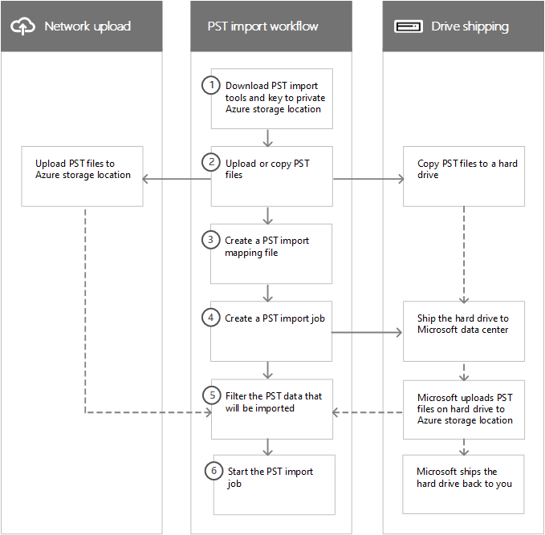
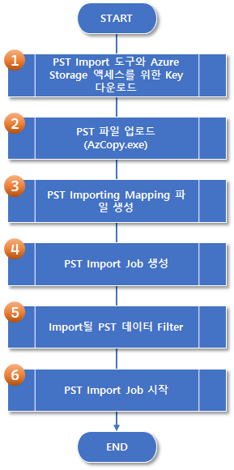

---
title: Importing PST file to Microsoft 365
filename: Exchange\ExchangeOnline\Importing-PST-file-to-Microsoft-365.md
ms.date: 2022.04.13
---

# Importing PST file to Microsoft 365

> [!NOTE]  
> 일반 사용자가 자신의 사서함을 PST로 Import하려면 아래의 링크를 참조하세요.  
> [Import email, contacts, and calendar from an Outlook .pst file](https://go.microsoft.com/fwlink/p/?LinkID=785075)

[Microsoft 365 Compliance Center](https://go.microsoft.com/fwlink/p/?linkid=2077149)에서 Import 서비스를 사용할 수 있습니다.
PST를 Exchange Online 사서함으로 빠르게 bulk import할 수 있습니다.

Microsoft 365로 PST 파일을 Import 하는 두 가지 방식이 있습니다:

- **Network upload.** 임시 Azure Storage 위치로 network을 통해 PST 파일들을 업로드하고 Microsoft 365 Import 서비스를 통해 사서함으로 PST 데이터를 import합니다.

- **Drive Shipping.** BitLocker로 암호화된 hard drive에 PST 파일들을 복사하고 물리적으로 Microsoft에 물리적으로 배송합니다. Microsoft는 hard drive를 받아 임시 Azure Storage위치에 업로드합니다. 그리고, Microsoft 365 Import 서비스를 통해 사서함으로 PST 데이터를 import합니다.

아래 그림은 **Network Upload**와 **Drive Shipping** 방법 전체에 대하여 어떻게 PST 파일 Importing이 동작하는지를 보여줍니다.



---

## Before you import PST files

- Exchange Online에서 Mailbox Import Export role을 할당 받아야 합니다.

    조직 관리 역할 그룹을 만들고 Mailbox Import Export 역할을 할당한 후 구성원을 추가할 수 있습니다.

    자세한 내용은 [Manage role groups](https://docs.microsoft.com/en-us/Exchange/permissions-exo/role-groups) 의 "Add a role to a role group" 또는 "Create a role group" 세션을 확인하세요.

- Microsoft로 PST 파일을 업로드할 수 있는 유일한 방법은 AzCopy 도구를 사용하는 것입니다.

    Azure Storage Explorer를 사용하여 업로드할 수 없습니다.

- 각 PST 파일은 20GB를 넘지 않는 것을 권장합니다. 큰 파일은 PST Import 프로세스 성능에 영향이 발생할 수 있습니다.

- URL에는 access key가 포함되어 있어 암호나 기타 보안 관련 정보를 보호하는 것처럼 특히 주의해서 이 URL을 보호해야 합니다.

- 비활성 사서함에 PST 파일을 Import할 수 있는데, PST Importing Mapping 파일에 `Mailbox` 매개 변수로 비활성 사서함의 GUID를 지정하여야 합니다.

- Exchange Hybrid 환경에서 On-Prem 사서함을 가지는 사용자의 PST 파일을 클라우드 기반 보관 사서함으로 가져올 수 있습니다. 

    PST Importing Mapping 파일에 `Mailbox` 매개 변수로 사용자의 email address를 지정하고 `IsArchive` 매개 변수에 TRUE 값을 지정합니다.

- PST 파일을 가져온 후에는 사서함의 보존 보류 설정이 무기한으로 설정됩니다.

    이는 가져온 메시지가 오래된 경우 사서함에 구성된 보존 설정에 따라 보존 기간이 만료되어 영구적으로 삭제될 수 있기에, 보존 보류 상태로 두어 사서함 사용자에게 새로 가져온 메시지를 관리할 수 있는 시간을 제공하거나 사서함 보존 설정을 변경할 시간을 제공하기 위해서입니다.

    > 아래 명령을 통하여 보존 보류를 해제하거나 특정 날짜에 헤제되게 할 수 있습니다:
    >
    > ```powershell
    > Set-Mailbox -RetentionHoldEnabled $false
    > Set-Mailbox -EndDateForRetentionHold 7/1/2022
    > ```

- Microsoft 365 사서함에서 받을 수 있는 최대 메시지 크기는 기본값으로 35MB이며 최대 150MB까지 설정할 수 있습니다. 가져오는 PST 파일에 35MB를 넘는 항목이 있는 경우 자동으로 `maxReceiveSize`가 150MB로 설정됩니다.

> [!INFO]  
> [Learn about importing your organization's PST files](https://docs.microsoft.com/en-us/microsoft-365/compliance/importing-pst-files-to-office-365)

---

## Importing PST files



1. PST Import 도구와 Azure Storage 액세스를 위한 Key 다운로드

1. PST 파일 업로드

1. PST Importing Mapping 파일 생성

1. PST Import Job 생성

1. Import될 PST 데이터 Filter

1. PST Import Job 시작

### PST Import 도구와 Azure Storage 액세스를 위한 Key 다운로드


### PST 파일 업로드


### PST Importing Mapping 파일 생성


### PST Import Job 생성


### Import될 PST 데이터 Filter


### PST Import Job 시작


---
