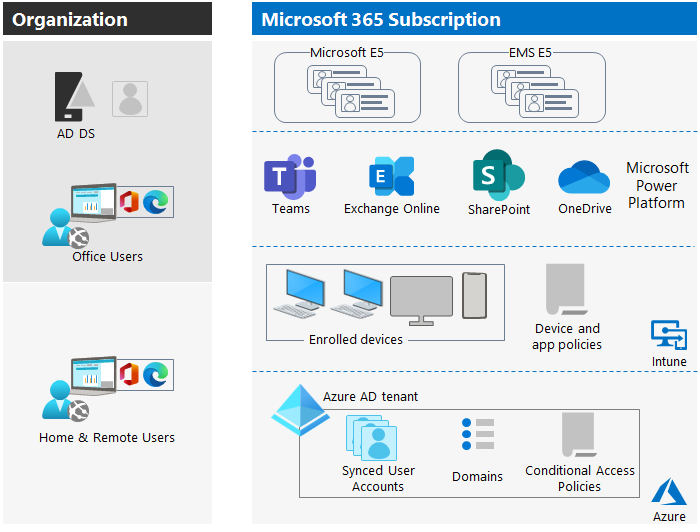

# Configure your Microsoft 365 tenant

Microsoft 365의 경우 구성 프로세스에는 다음이 포함됩니다.

- 조직 프로필 설정
- 테넌트 구독 관리
- 서비스 및 추가 기능 관리
- 테넌트 구성 완료

## Microsoft 365 Cloud 환경 탐색

### Microsoft 365 구독 및 계획

Microsoft 365의 맥락에서 "계획"은 일반적으로 구독에 포함된 특정 기능 및 서비스 집합을 나타냅니다. Microsoft는 각각 기능과 가격 구조가 다른 E3 또는 E5와 같은 Microsoft 365의 다양한 플랜 또는 에디션을 제공합니다. 이러한 계획은 사용자가 사용할 수 있는 특정 기능 및 응용 프로그램과 포함된 기타 서비스 또는 혜택을 결정합니다.

반면에 "구독"은 일반적으로 특정 Microsoft 365 플랜에 대한 액세스 권한을 획득하는 행위를 의미합니다.

### Microsoft 365 구독 및 Azure AD 테넌트에 클라우드 컴퓨팅 기반 구축

클라우드 컴퓨팅 기반을 구축하려면 먼저 Microsoft 365 구독과 Azure AD(Azure Active Directory) 테넌트 간의 관계를 이해해야 합니다.

Microsoft 365 계획은 저장, 공동 작업 및 커뮤니케이션을 위한 클라우드 서비스와 함께 Word, Excel, PowerPoint 및 Outlook과 같은 다양한 Microsoft 제품에 대한 액세스를 제공합니다. 예를 들어 Exchange Online, SharePoint Online, 비즈니스용 OneDrive, Microsoft Teams 등이 있습니다.

Azure AD 테넌트는 Office 응용 프로그램, Exchange Online, SharePoint, Teams 등과 같은 Microsoft 365 서비스에 대한 사용자 인증, 권한 부여 및 기타 ID 관련 기능을 활성화하는 기본 기반입니다. 이 단일 테넌트 환경을 통해 조직 내에서 Microsoft 365 및 Azure 서비스를 원활하게 통합하고 관리할 수 있습니다.

Azure AD 테넌트는 해당 구독과 연결된 모든 리소스를 보유하는 컨테이너입니다. 테넌트는 조직 서비스의 URL을 결정합니다. 또한 조직의 Microsoft 365 관리자가 브랜딩 및 보안 정책과 같은 회사의 전역 설정을 관리할 수 있는 곳이기도 합니다.

### Azure AD 테넌트를 만들지 않는 Microsoft 365 계획

Microsoft는 일부 Microsoft 365 계획이 Azure AD 테넌트를 만들지 않기 때문에 여전히 구독에 대해 단일 Azure AD 테넌트만 만듭니다. "Azure AD Free" 또는 "Azure AD 기본" 계획이라고도 하며 제한된 Azure AD 기능을 제공하고 전체 Azure AD 테넌트 생성을 포함하지 않습니다.

- Enterprise Mobility + Security (EMS) E5.
- Microsoft 365 Business Basic. 
- Microsoft 365 Business Standard.
- Microsoft 365 Apps.
- Office 365 F3.
- Microsoft 365 F1.

이러한 계획은 Azure AD 테넌트를 생성하지 않지만 사용자 관리 및 인증 목적을 위해 여전히 Azure AD 기능이 제한되어 있을 수 있습니다. 그러나 고급 ID 보호, 조건부 액세스 및 장치 관리와 같은 고급 Azure AD 기능 및 기능의 경우 일반적으로 Azure AD 테넌트를 생성하는 Microsoft 365 E3 또는 E5와 같은 상위 계층 계획을 고려해야 합니다.

### 라이선스

Microsoft 365 계획을 구독할 때 계획에 대해 구매하는 라이선스 수는 일반적으로 조직에 필요한 사용자 또는 시트 수를 기반으로 합니다. 일반적인 프로세스는 다음과 같습니다.

1. **조직에 적합한 Microsoft 365 플랜을 선택하세요.** Microsoft는 기능과 서비스가 다른 다양한 요금제를 제공합니다. 각 계획에는 고유한 기능 및 응용 프로그램 집합이 있습니다. 필요한 기능에 따라 필요에 가장 적합한 요금제를 선택합니다.
1. **조직에 적합한 라이선스 수와 함께 Microsoft 365 플랜을 구매하세요.** Microsoft 365 플랜을 구독하면 해당 플랜에 대해 특정 수의 사용자 또는 시트를 구매합니다. 예를 들어 직원이 50명인 경우 선택한 계획에 대해 50개의 사용자 라이선스에 대한 구독을 구매합니다.
1. **라이선스를 할당합니다.** 구독을 구매한 후에는 Microsoft 365 계획에 대한 라이선스를 조직 내의 개별 사용자에게 할당할 수 있습니다. Microsoft 365 관리 센터를 통해 이 프로세스를 관리합니다. 특정 사용자에게 라이선스를 할당하여 플랜에 포함된 기능 및 서비스에 대한 액세스 권한을 부여할 수 있습니다.
1. **라이선스를 관리하세요.** 조직의 요구 사항이 변경되면 필요에 따라 라이선스를 추가하거나 제거할 수 있습니다. 새로운 사용자를 수용하기 위해 계획에 대해 더 많은 라이센스를 구입할 수 있습니다. 조직을 떠나거나 더 이상 액세스가 필요하지 않은 사용자의 라이선스를 제거할 수도 있습니다. 이러한 유연성을 통해 조직의 규모와 요구 사항에 따라 라이선스를 확장할 수 있습니다.

> [!IMPORTANT]  
> 라이선스 할당 및 관리에 대한 구체적인 세부 정보는 선택한 Microsoft 365 요금제 및 선택한 기타 서비스 또는 추가 기능에 따라 다를 수 있습니다. Microsoft는 라이선스를 효과적으로 관리하는 데 도움이 되는 도구와 리소스를 제공하여 라이선스 조건을 준수하면서 조직의 사용자에게 적절한 수의 라이선스를 보유하도록 합니다.

### 여러 Azure Active Directory 테넌트가 있는 조직

Microsoft 365 구독을 구매하면 Microsoft에서 Azure AD 테넌트를 만듭니다. 테넌트는 구독한 Microsoft 365 계획에 대한 ID 및 액세스 관리 인프라를 지원하고 제공합니다. Microsoft 365 및 Azure에 대한 단일 테넌트를 보유함으로써 관리를 간소화하고 사용자 관리를 단순화하며 두 플랫폼 모두에서 일관된 보안 및 액세스 제어를 설정할 수 있습니다. 조직의 클라우드 서비스 및 리소스를 관리하기 위한 응집력 있는 환경을 제공합니다.

대기업이 여러 Microsoft 365 구독을 선택하는 데에는 몇 가지 이유가 있습니다.

- **다양한 사용자 요구 사항.** 기업 내 여러 부서 또는 팀은 생산성 도구, 공동 작업 기능 및 보안 제어와 관련하여 다양한 요구 사항을 가질 수 있습니다. 조직에서 여러 Microsoft 365 구독을 구매하면 각 사용자 그룹의 특정 요구 사항에 따라 제품을 사용자 지정할 수 있습니다.
- **라이센스 유연성.** 대기업에는 정규직 직원, 시간제 직원, 계약직 직원 및 외부 협력자가 혼합되어 있을 수 있습니다. 여러 구독을 통해 조직은 다양한 사용자 범주의 요구 사항과 사용 패턴에 맞는 적절한 라이선스 모델(사용자 기반 또는 장치 기반) 및 라이선스 유형(예: Microsoft 365 E3, E5 또는 F1)을 선택할 수 있습니다.
- **규정 준수 및 보안 고려 사항.** 일부 산업 또는 규정 프레임워크에는 특정 보안 및 규정 준수 조치가 필요합니다. 대기업은 데이터 보호 및 거버넌스를 보장하면서 이러한 요구 사항을 충족하기 위해 고급 보안 및 규정 준수 기능을 제공하는 여러 구독을 선택할 수 있습니다.
- **인수 합병.** 합병 또는 인수에 관련된 조직은 여러 레거시 시스템 또는 기존 Microsoft 365 환경으로 끝날 수 있습니다. 이러한 시스템을 단일 가입으로 통합하는 데는 시간이 걸릴 수 있으며 전환 기간 동안 여러 가입을 유지해야 합니다.

Microsoft 365 계획에 대한 등록 프로세스 중에 Microsoft는 조직에 회사 이름, 국가/지역 및 도메인 이름과 같은 몇 가지 기본 정보를 제공하도록 요청합니다. 그런 다음 Microsoft는 조직의 새 Azure AD 테넌트를 만들 때 이 정보를 사용합니다. Microsoft는 등록 중에 조직에서 제공한 도메인 이름에 대해 만드는 테넌트 URL을 기반으로 합니다. 일반적으로 다음과 같습니다. https://contoso.onmicrosoft.com.

Microsoft 365 구독을 사용하면 단일 테넌트에 최대 900개의 도메인을 추가할 수 있습니다.

### 잘 설계된 Azure AD 테넌트의 특성

조직의 테넌트에 대한 올바른 이름과 위치 외에도 조직에서 계획, 배포 및 관리해야 하는 다른 요소가 있습니다. 이러한 요소를 적절하게 설계하고 관리하는 조직은 Microsoft Teams 및 Exchange Online과 같은 클라우드 생산성 앱에 대한 사용자 경험이 효과적이고 안전하며 성능이 우수하도록 보장합니다.

조직은 Azure AD 테넌트에 대해 다음 요소를 적절하게 구성하고 관리해야 합니다.

- 올바른 제품(구독) 및 라이선스 세트
    - 제품 세트는 비즈니즈, IT 및 보안 요구 사항과 일합니다.
    - 직원을 위한 충분한 수의 라이선스가 있고 예상되는 인력 변경이 있습니다.
- 네트워킹
    - 올바른 DNS 도메인 이름을 구성했습니다.
    - 엔터프라이즈 네트워크의 경우 현장 작업자를 위해 Microsoft 네트워크에 대한 네트워크 트래픽을 최적화했습니다.
    - VPN 클라이언트를 사용하는 원격 작업자를 위한 네트워크 트래픽을 최적화했습니다.
- OnPrem AD DS(Active Directory Domain Service)가 있는 경우 계정, 그룹 및 기타 개체를 동기화했습니다.
    - 이메일 주소에 대한 올바른 DNS 도메인을 사용하여 Azure AD 테넌트 계정을 Exchange Online 사서함에 매핑했습니다.
    - 올바른 구매 제품(예:Microsoft 365 E3 또는 E5)의 올바른 라이선스를 사용자 계정에 할당했습니다.
- 강력한 ID 및 액세스 관리를 구성했습니다.
    - 비밀번호 없는 인증 또는 다단계 인증(MFA)을 사용하는 보안 사용자 로그인이 필요합니다.
    - 더 높은 수준의 바안을 위해 로그인 요구 사항 및 제한을 적용하는 조건부 액세스 정책을 만들었습니다.
- OnPrem Office 서버와 해당 데이터를 클아우드 앱으로 마이그레이션하거나 해당 데이터를 하이브리드 구성으로 배포했습니다.
- Microsoft 365에 내장된 Intune 또는 기본 이동성 및 보안을 사용하여 장치 관리를 수행합니다.
    - 조직 소유 장치를 등록하고 관리합니다.
    - 개인 기기용 앱을 관리합니다.

다음 다이어그램은 Microsoft 365 구독을 지원하기 위해 이러한 모든 요소가 있는 Azure AD 테넌트의 예를 보여줍니다.

이 그림에서 Azure AD 테넌트에는 다음이 포함됩니다.

- Microsoft 365 E5 및 Enterprise Mobility용 제품 및 라이선스. + 보안 E5.
- Microsoft 365 생산성 앱.
- 등록된 디바이스와 디바이스 및 애플리케이션 정책으로 Intune합니다.
- 동기화된 사용자 계정, 도메인 및 조건부 액세스 정책이 있는 Azure AD 테넌트. 다이어그램에는 그룹 및 기타 디렉터리 개체가 표시되지 않습니다.

> [!REF]  
> https://learn.microsoft.com/en-us/training/modules/configure-microsoft-365-experience/2-explore-your-microsoft-365-cloud-environment

---

## Configure your Microsoft 365 organizational profile

회사의 조직 프로필을 완성하는 것은 회사의 Azure AD 테넌트를 설정할 때 시작점입니다. Microsoft 365 관리자가 유지 관리해야 하는 일부 속성으로 인해 불완전한 경우 프로비저닝 프로세스가 중단됩니다. 예를 들어 그러한 속성 중 하나는 주소 라인입니다. 조직에 완전한 주소가 없으면 프로비저닝 프로세스가 중지됩니다.

---