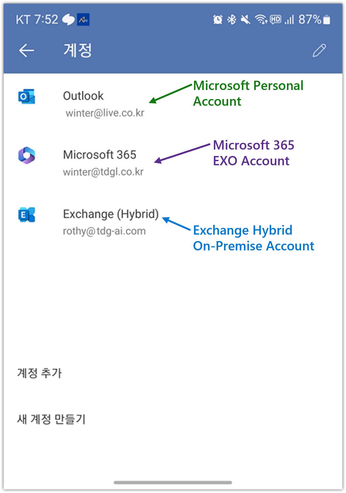

# Configure Microsoft 365 Hybrid Infra

On-Premise 환경의 Active Directory 및 Exchange 환경의 고객이 Microsoft 365의 Cloud SaaS 서비스로 전환하는 과정에 대하여 시나리오 기반으로 구성 과정을 설명합니다.

특히, Exchange Web Services에 대한 Proxy로 Entra Application Proxy로 구성합니다.

또한, Exchange Hybrid 구성에 HMA (Hybrid Modern Authentication)를 구성하여 모든 Clients 종류의 액세스에 Modern Authentication으로 구성합니다.

## Hybrid Infra 시나리오

- 기존 On-Premise 환경
    - Active Directory Single Forest Single Domain
    - Exchange 2019 CU14 Mailbox Server
    - Exchange 2019 CU14 Edge Transport Server

- To-Be Hybrid 인프라 구성
    

    - **NEW: Entra Connect Server.** On-Premise의 Active Directory의 Identities 정보를 Entra ID로 동기화
    - **NEW: Entra Application Proxy Service.** Entra Enterprise Application을 생성하고, Application Proxy 설정으로 통해 On-Premise의 Exchange Web Service를 hosting.
    - **NEW: Entra Private Network Connector.** Entra Application Proxy 구성 시 Application Proxy Service와 여결되는 connector. Exchange의 web services에 액세스가 가능해야 함.

[<i class="fa fa-chevron-up" aria-hidden="true"></i> Top](#)

---

## Hybrid Identity 및 Exchange Hybrid Infra 구성요소

- [Active Directory](#active-directory)
- [On-Premise Exchange Organization](#on-premise-exchange-organization)
    - [Exchange Mailbox Server](#exchange-mailbox-server)
        - [Hybrid Modern Authentication](#hybrid-modern-authentication)
    - [Exchange Edge Transport Server](#exchange-edge-transport-server)
- Microsoft 365
    - Custom Domain
    - Network Connectivity for Hybrid Environment
- Entra Connect Sync Server
- Entra Application Proxy
    - Entra Private Network Connector
    - Entra Enterprise Application with Application Proxy
    - MRS Proxy Endpoint
- Exchange Hybrid
    - On-Premise Exchange Configuration
    - Exchange Online Configuration
- Clients
    - Outlook Desktop App
    - Outlook On the Web (OWA) and ECP
    - Mobile Outlook

[<i class="fa fa-chevron-up" aria-hidden="true"></i> Top](#)

---

## Active Directory

On-Premise Exchange의 마지막 버전인 Exchange 2019이기에 이를 기준으로 Active Directory Requirements를 명시합니다.

- Domain Controller: Windows Server 2012 R2 이상 권장
- AD Forest Level: Windows Server 2016 이상 권장

[<i class="fa fa-chevron-up" aria-hidden="true"></i> Top](#)

---

## On-Premise Exchange Organization

Exchange의 마지막 버전인 Exchange 2019로 구성합니다.
이전 버전의 Exchange인 경우는 Exchange Hybrid 구성 시 On-Premise에서 Exchange Online으로 메일 전송에 throttling  및 blocking 이 발생할 수 있습니다.

> [!NOTE]
>
> [Throttling and Blocking Email from Persistently Vulnerable Exchange Servers to Exchange Online](https://techcommunity.microsoft.com/t5/exchange-team-blog/throttling-and-blocking-email-from-persistently-vulnerable/ba-p/3815328)
>
> [Update on Transport Enforcement System in Exchange Online](https://techcommunity.microsoft.com/t5/exchange-team-blog/update-on-transport-enforcement-system-in-exchange-online/ba-p/3827774)

참고로, Microsoft에서는 Exchange 2019 이후 버전에 대한 언급이 없어 마지막 Exchange Server 버전일 수 있습니다.

> [!NOTE]
>
> Exchange Server 2019의 지원 [Lifecycle](https://learn.microsoft.com/en-us/lifecycle/products/exchange-server-2019)은 아래와 같습니다:
> - Mainstream End Date: Jan 9, 2024
> - Extended End Date: Oct 14, 2025
>
> 참고: Extended Support가 완료되면 Non-Security updates 와 DCR 요청을 할 수 없습니다.
>
> 참고: Security updates의 경우 Extended Security Update Program에 의하여 가능할 수 있습니다.

### Exchange Mailbox Server

Exchange Server 설치 시 AD의 built-in administrator 계정이 아닌 필요한 권한을 부여한 새로운 Exchange Organization management 관리 역할 계정으로 설치하기를 권장합니다.


> [!IMPORTANT]
>
> Exchange의 관리자 계정이 built-in AD administrator인 경우, Entra Connect Sync에서 Entra ID로 동기화되지 않습니다. 기본 Join inbound 동기화 규칙에 `isCriticalSystemObject notequal TRUE` 필터가 있고 built-in AD administrator 계정의 `isCriticalSystemObject`은 `TRUE`로 설정되어 있습니다.
따라서, Hybrid Modern Authentication (HMA)를 활성화하는 경우는 Exchange Organization의 설치 및 Organization Management 관리 역할 그룹의 구성원을 별도로 생성 추가하는 것이 좋습니다.
>
> 이 Organization Management 관리 역할 그룹의 구성원은 Exchange 조직의 Exchange 개체와 그 속성을 관리할 권한이 있습니다.
>
> OWA 와 ECP에 대하여 HMA를 활성화 한 경우  Entra ID로 부터 인증을 받기에 Entra ID에 동기화 되지 않은 계정으로는 sign-in을 할 수 없습니다.

또한, Exchange 2019 최신 CU 설치를 권장합니다.

> [!NOTE] 
>
> [Exchange Server build numbers and release dates](https://learn.microsoft.com/en-us/exchange/new-features/build-numbers-and-release-dates?view=exchserver-2019#exchange-server-2019)

Entra Application Proxy를 Exchange Web Services들에 대하여 구현하는 경우, OWA 및 ECP, MAPI 에 대한 Windows Authentication의 Provider에서 NTLM을 제거하기를 권장합니다.

Connector 서버가 AD에 join되어 있지 않다면, Negotiate로 설정하는 것이 좋습니다..


Exchange Mailbox Server를 설치 후 조직의 환경이나 요건에 맞게끔 아래의 설정들을 적절히 변경합니다.
Url 및 Authentication 관련 설정들에 대하여 충분히 검토합니다.

##### OutlookAnywhere

```powershell
Get-OutlookAnywhere | fl *hostname,*clientauthenticationmethod,*requireSsl

<# OUTPUT:

ExternalHostname                   : exchange.tdg-ai.com
InternalHostname                   : exchange.tdg-ai.com
ExternalClientAuthenticationMethod : Negotiate
InternalClientAuthenticationMethod : Ntlm
ExternalClientsRequireSsl          : True
InternalClientsRequireSsl          : True

#>
```

##### ClientAccessService

```powershell
Get-ClientAccessService | fl AutoDiscoverServiceInternalUri

<# OUTPUT:

AutoDiscoverServiceInternalUri : https://exchange.tdg-ai.com/Autodiscover/Autodiscover.xml

#>
```

##### EcpVirtualDirectory

```powershell
Get-EcpVirtualDirectory | fl *url, *auth*

<# OUTPUT:

InternalUrl                   : https://exchange.tdg-ai.com/ecp
ExternalUrl                   : https://exchange.tdg-ai.com/ecp
InternalAuthenticationMethods : {OAuth}
BasicAuthentication           : False
WindowsAuthentication         : False
DigestAuthentication          : False
FormsAuthentication           : False
LiveIdAuthentication          : False
AdfsAuthentication            : False
OAuthAuthentication           : True
ExternalAuthenticationMethods : {Fba}

#>
```

##### WebServicesVirtualDirectory

```powershell
Get-WebServicesVirtualDirectory | fl *url, *auth*

<# OUTPUT:

InternalNLBBypassUrl          :
InternalUrl                   : https://exchange.tdg-ai.com/EWS/Exchange.asmx
ExternalUrl                   : https://exchange.tdg-ai.com/EWS/Exchange.asmx
CertificateAuthentication     :
InternalAuthenticationMethods : {Ntlm, WindowsIntegrated, WSSecurity, OAuth}
ExternalAuthenticationMethods : {Ntlm, WindowsIntegrated, WSSecurity, OAuth}
LiveIdNegotiateAuthentication :
WSSecurityAuthentication      : True
LiveIdBasicAuthentication     : False
BasicAuthentication           : False
DigestAuthentication          : False
WindowsAuthentication         : True
OAuthAuthentication           : True
AdfsAuthentication            : False

#>
```

##### MapiVirtualDirectory

```powershell
Get-MapiVirtualDirectory | fl *url, *auth*

<# OUTPUT:

InternalUrl                   : https://exchange.tdg-ai.com/mapi
ExternalUrl                   : https://exchange.tdg-ai.com/mapi
IISAuthenticationMethods      : {Ntlm, OAuth, Negotiate}
InternalAuthenticationMethods : {Ntlm, OAuth, Negotiate}
ExternalAuthenticationMethods : {Ntlm, OAuth, Negotiate}

#>
```

##### ActiveSyncVirtualDirectory

```powershell
Get-ActiveSyncVirtualDirectory | fl *url, *auth*

<# OUTPUT:

MobileClientCertificateAuthorityURL :
InternalUrl                         : https://exchange.tdg-ai.com/Microsoft-Server-ActiveSync
ExternalUrl                         : https://exchange.tdg-ai.com/Microsoft-Server-ActiveSync
MobileClientCertificateAuthorityURL :
BasicAuthEnabled                    : True
WindowsAuthEnabled                  : False
ClientCertAuth                      : Ignore
InternalAuthenticationMethods       : {}
ExternalAuthenticationMethods       : {}

#>
```

##### OabVirtualDirectory

```powershell
Get-OabVirtualDirectory | fl *url, *auth*

<# OUTPUT:

InternalUrl                   : https://exchange.tdg-ai.com/OAB
ExternalUrl                   : https://exchange.tdg-ai.com/OAB
BasicAuthentication           : False
WindowsAuthentication         : True
OAuthAuthentication           : True
InternalAuthenticationMethods : {WindowsIntegrated, OAuth}
ExternalAuthenticationMethods : {WindowsIntegrated, OAuth}

#>
```

##### OwaVirtualDirectory

```powershell
Get-OwaVirtualDirectory | fl *url, *auth*

<# OUTPUT:

Url                           : {}
InternalSPMySiteHostURL       :
ExternalSPMySiteHostURL       :
SetPhotoURL                   :
Exchange2003Url               :
FailbackUrl                   :
InternalUrl                   : https://exchange.tdg-ai.com/owa
ExternalUrl                   : https://exchange.tdg-ai.com/owa
ClientAuthCleanupLevel        : High
InternalAuthenticationMethods : {OAuth}
BasicAuthentication           : False
WindowsAuthentication         : False
DigestAuthentication          : False
FormsAuthentication           : False
LiveIdAuthentication          : False
AdfsAuthentication            : False
OAuthAuthentication           : True
ExternalAuthenticationMethods : {Fba}

#>
```

##### PowerShellVirtualDirectory

```powershell
Get-PowerShellVirtualDirectory | fl *url, *auth*

<# OUTPUT:

InternalUrl                   : http://exchange.tdg-ai.com/powershell
ExternalUrl                   : http://exchange.tdg-ai.com/powershell
CertificateAuthentication     : True
InternalAuthenticationMethods : {}
ExternalAuthenticationMethods : {}
LiveIdNegotiateAuthentication : False
WSSecurityAuthentication      : False
LiveIdBasicAuthentication     : False
BasicAuthentication           : False
DigestAuthentication          : False
WindowsAuthentication         : False
OAuthAuthentication           : False
AdfsAuthentication            : False

#>
```

#### Hybrid Modern Authentication

Exchange 서버에 Hybrid Modern Authentication 구성을 하여 On-Premise Mailbox 사용자의 Outlook Desktop 앱 및 OWA, Mobile Outlook 앱에서 액세스를 Entra ID의 조건부 액세스로 제어할 수 있습니다.

- **Outlook Desktop App:**

    

    **참고:** Outlook Connection Status에서 Authn 항목의 Bearer* 인 경우 OAuth 인증으로 연결된 경우입니다.

- **Outlook Web App (OWA):**

    

    **참고:** 브라우저에서 Outlook Web App URL로 액세스 시 자동으로 Entra ID Sign-in으로 자동 전환됩니다.

- **Mobile Outlook App (in Android or iOS):**

    

    **참고:** Mobile Outlook App의 설정의 계정에서 Exchange hybrid 로 표시되는 경우 OAuth로 연결된 경우입니다.

##### Hybrid Modern Authentication Configuration

Hybrid Modern Authentication 구성은 아래의 절차를 참조하여 구성할 수 있습니다:

1. [Add on-premises web service URLs as SPNs in Microsoft Entra ID](https://learn.microsoft.com/en-us/microsoft-365/enterprise/configure-exchange-server-for-hybrid-modern-authentication?view=o365-worldwide#add-on-premises-web-service-urls-as-spns-in-microsoft-entra-id)

    ```powershell
    Install-Module Microsoft.Graph -Scope AllUsers

    Connect-MgGraph -Scopes Application.Read.All, Application.ReadWrite.All
    
    Get-MgServicePrincipal -Filter "AppId eq '00000002-0000-0ff1-ce00-000000000000'" | select -ExpandProperty ServicePrincipalNames

    <# OUTPUT:
    
    https://autodiscover.tdg-ai.com/
    https://exchange.tdg-ai.com/
    00000002-0000-0ff1-ce00-000000000000/outlook.office365.com
    00000002-0000-0ff1-ce00-000000000000/mail.office365.com
    00000002-0000-0ff1-ce00-000000000000/outlook.com
    00000002-0000-0ff1-ce00-000000000000/*.outlook.com
    00000002-0000-0ff1-ce00-000000000000
    https://ps.compliance.protection.outlook.com
    https://outlook-sdf.office.com/
    https://outlook-sdf.office365.com/
    https://outlook.office365.com:443/
    https://outlook.office.com/
    https://outlook.office365.com/
    https://outlook.com/
    https://ps.protection.outlook.com/
    https://outlook-tdf.office.com/
    https://outlook-tdf-2.office.com/
    https://ps.outlook.com
    https://outlook.office.com
    
    #>
    
    $x = Get-MgServicePrincipal -Filter "AppId eq '00000002-0000-0ff1-ce00-000000000000'"
    $ServicePrincipalUpdate = @(
    "https://exchange.tdg-ai.com/","https://exchange.tdg-ai.com/"
    )
    Update-MgServicePrincipal -ServicePrincipalId $x.Id -ServicePrincipalNames $ServicePrincipalUpdate
    ```
2. [Verify Virtual Directories are Properly Configured](https://learn.microsoft.com/en-us/microsoft-365/enterprise/configure-exchange-server-for-hybrid-modern-authentication?view=o365-worldwide#verify-virtual-directories-are-properly-configured)

    ```powershell
    Get-MapiVirtualDirectory | FL server,*url*,*auth*
    
    Server                        : CASMAILBOX
    InternalUrl                   : https://exchange.tdg-ai.com/mapi
    ExternalUrl                   : https://exchange.tdg-ai.com/mapi
    IISAuthenticationMethods      : {Ntlm, OAuth, Negotiate}
    InternalAuthenticationMethods : {Ntlm, OAuth, Negotiate}
    ExternalAuthenticationMethods : {Ntlm, OAuth, Negotiate}
    
    Get-WebServicesVirtualDirectory | FL server,*url*,*oauth*
    
    Server               : CASMAILBOX
    InternalNLBBypassUrl :
    InternalUrl          : https://exchange.tdg-ai.com/EWS/Exchange.asmx
    ExternalUrl          : https://exchange.tdg-ai.com/EWS/Exchange.asmx
    OAuthAuthentication  : True
    
    Get-OABVirtualDirectory | FL server,*url*,*oauth*
    
    Server              : CASMAILBOX
    InternalUrl         : https://exchange.tdg-ai.com/OAB
    ExternalUrl         : https://exchange.tdg-ai.com/OAB
    OAuthAuthentication : True
    
    Get-AutoDiscoverVirtualDirectory | FL server,*oauth*
    
    Server              : CASMAILBOX
    OAuthAuthentication : True
    ```

1. [Confirm the EvoSTS Auth Server Object is Present](https://learn.microsoft.com/en-us/microsoft-365/enterprise/configure-exchange-server-for-hybrid-modern-authentication?view=o365-worldwide#confirm-the-evosts-auth-server-object-is-present)

    ```powershell
    Get-AuthServer | where {$_.Name -like "EvoSts*"} | ft name,enabled
    
    Name   Enabled
    ----   -------
    evoSTS    True
    
    <# 또는 evoSTS - {ad12601a-7684-499a-8214-91f1a1d5ffbb<tenant_id>} 이름으로 존재함 #>
    ```

1. [Enable HMA](https://learn.microsoft.com/en-us/microsoft-365/enterprise/configure-exchange-server-for-hybrid-modern-authentication?view=o365-worldwide#enable-hma)

    ```powershell
    Set-AuthServer -Identity "EvoSTS - {GUID}" -DomainName "M365x68919772.onmicrosoft.com" -IsDefaultAuthorizationEndpoint $true
    
    Set-OrganizationConfig -OAuth2ClientProfileEnabled $true
    ```

1. To enable Hybrid Modern Authentication for OWA and ECP

    ```powershell
    Get-OwaVirtualDirectory -Server <computername> | Set-OwaVirtualDirectory -AdfsAuthentication $false –BasicAuthentication $false –FormsAuthentication $false –DigestAuthentication $false
    Get-EcpVirtualDirectory -Server <computername> | Set-EcpVirtualDirectory -AdfsAuthentication $false –BasicAuthentication $false –FormsAuthentication $false –DigestAuthentication $false
    
    Get-EcpVirtualDirectory -Server <computername> | Set-EcpVirtualDirectory -OAuthAuthentication $true
    Get-OwaVirtualDirectory -Server <computername> | Set-OwaVirtualDirectory -OAuthAuthentication $true
    ```

    > [!IMPORTANT]
    >
    > Exchange의 관리자 계정이 built-in AD administrator인 경우, Entra Connect Sync에서 Entra ID로 동기화되지 않습니다. 기본 Join inbound 동기화 규칙에 `isCriticalSystemObject notequal TRUE` 필터가 있고 built-in AD administrator 계정의 `isCriticalSystemObject`은 `TRUE`로 설정되어 있습니다.
    따라서, Hybrid Modern Authentication (HMA)를 활성화하는 경우는 Exchange Organization의 설치 및 Organization Management 관리 역할 그룹의 구성원을 별도로 생성 추가하는 것이 좋습니다.
    >
    > 이 Organization Management 관리 역할 그룹의 구성원은 Exchange 조직의 Exchange 개체와 그 속성을 관리할 권한이 있습니다.
    >
    > OWA 와 ECP에 대하여 HMA를 활성화 한 경우  Entra ID로 부터 인증을 받기에 Entra ID에 동기화 되지 않은 계정으로는 sign-in을 할 수 없습니다.

1. To enable Hybrid modern Authentication for Mapi (Outlook) and ActiveSync

```powershell

Get-MapiVirtualDirectory  | Set-MapiVirtualDirectory -IISAuthenticationMethods OAuth
Get-MapiVirtualDirectory  | fl *Auth*

<# OUTPUT

IISAuthenticationMethods      : {OAuth}
InternalAuthenticationMethods : {OAuth}
ExternalAuthenticationMethods : {OAuth}

#>

Get-ActiveSyncVirtualDirectory | Set-ActiveSyncVirtualDirectory -InternalAuthenticationMethods OAuth -ExternalAuthenticationMethods OAuth
Get-ActiveSyncDeviceAccessRule -Identity 'Outlook for iOS and Android (DeviceModel)' | Set-ActiveSyncDeviceAccessRule -AccessLevel Allow
Get-ActiveSyncDeviceAccessRule | ft Name,AccessLevel

<# OUTPUT:
Name                                      AccessLevel
----                                      -----------
OutlookService (DeviceType)                     Allow
Outlook for iOS and Android (DeviceModel)       Allow
Outlook (DeviceType)                            Allow
#>

$servicePrincipal = Get-MgServicePrincipal -Filter "AppId eq '00000002-0000-0ff1-ce00-000000000000'"
$servicePrincipal.ReplyUrls += "https://exchange.tdg-ai.com/mapi"
$servicePrincipal.ReplyUrls += "https://exchange.tdg-ai.com/Microsoft-Server-ActiveSync"
Update-MgServicePrincipal -ServicePrincipalId $servicePrincipal.Id -AppId "00000002-0000-0ff1-ce00-000000000000" -ReplyUrls $servicePrincipal.ReplyUrls

$servicePrincipal = Get-MgServicePrincipal -Filter "AppId eq '00000002-0000-0ff1-ce00-000000000000'"
$servicePrincipal.ReplyUrls

<# OUTPUT:

https://exchange.tdg-ai.com/Microsoft-Server-ActiveSync
https://exchange.tdg-ai.com/mapi
https://exchange.tdg-ai.com/ecp
https://exchange.tdg-ai.com/owa
https://sdfpilot.outlook.com/owa
https://outlook.office365.com/owa
https://outlook.cloud.microsoft
https://outlook-sdf.cloud.microsoft

#>
```

### Exchange Edge Transport Server


[<i class="fa fa-chevron-up" aria-hidden="true"></i> Top](#)

---

## Entra Application Proxy

On-Premise Exchange의 Web Services들에 대하여 Entra Application Proxy로 Reverse-Proxy 구성에 대한 전체 구성도는 아래와 같습니다:


### Entra Enterprise Application

- Type: On-Premise Application (Application Proxy)
- Name: EWS - Exchange
- Attributes:
    - 사용자가 로그인할 수 있습니까? - 예
    - 할당이 필요합니까? - 아니요
    - 사용자가 볼 수 있습니까? - 예
- Application Proxy Settings
    - Internal URL: 
    - External URL: 
    - 사전 인증: 통과
    - 컨텍터 그룹: EWS Connector 0 아시아
    - SSL 인증서: CN:exchange.tdg-ai.com


### Private Network Connector

Service Limits and Restrictions

- A maximum of 500 transactions* per second per Application Proxy application.
- A maximum of 750 transactions per second for the Microsoft Entra organization.

*A transaction is defined as a single HTTP request and response for a unique resource. When clients are throttled, they receive a 429 response (too many requests). Transaction metrics are collected on each connector and can be monitored using performance counters under the object name Microsoft Entra private network connector.

> [!NOTE]
>
> [Microsoft Entra service limits and restrictions](https://learn.microsoft.com/en-us/entra/identity/users/directory-service-limits-restrictions)

[Private Network Connector Capacity Planning](https://learn.microsoft.com/en-us/entra/global-secure-access/concept-connectors#capacity-planning)

| Cores | RAM | Expected Latency (MS)-P99 | Max TPS |
| --- | --- | --- | --- |
| 2 | 8 | 325 | 586 |
| 4 | 16 | 320 | 1150 |
| 8 | 32 | 270 | 1190 |
| 16 | 64 | 245 | 1200 |


---